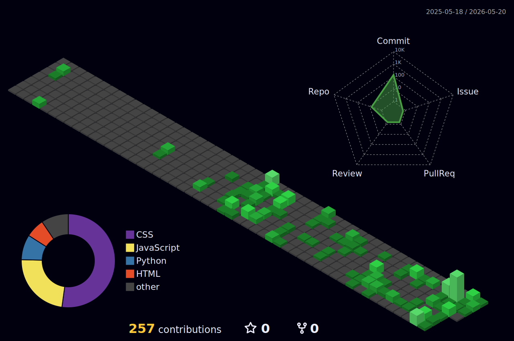

# 👨🏻‍💻 Celso Toledo

**`Desenvolvedor FullStack`**

Me chamo Celso Toledo, tenho 25 anos e um ano de experiência com desenvolvimento front-end, atualmente cursando Análise e Desenvolvimento de Sistemas.

Atualmente estudando React.

   

##

### 🚀 Linguagens e Tecnologias

 

  
       
  
                 

 

##

### 📊 Estatísticas

  

<!--  -->
 
 

  
 ##
  

