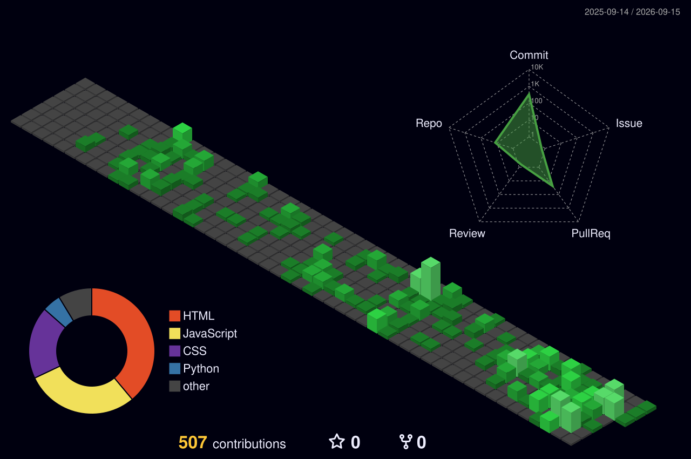

<h1>👨🏻‍💻 Celso Toledo</h1>

**`Desenvolvedor FullStack`**

Me chamo Celso Toledo, tenho 25 anos e um ano de experiência com desenvolvimento front-end, atualmente cursando Análise e Desenvolvimento de Sistemas.

Atualmente estudando React.

   

##

### 🚀 Linguagens e Tecnologias

 

  
       
  
  
  
          
                 

 

##

## Estatísticas 📊

<!-- 

  <table border="none" border="0" cellspacing="0" cellpadding="0" style="border: none; border-collapse: collapse;">
    <tr>
      <td align="center" valign="center" style="border: none; padding: 0 8px 0 0;">
        
      </td>
      <td align="center" valign="center" style="border: none; padding: 0 0 0 8px;">
        
      </td>
      </tr>
    <tr>
    <td colspan="2" align="center" valign="top" style="border: none; padding: 0 0 0 8px;">
      
    </td>
  </tr>

  </table>

 -->

  
  
  

  

   

  

<!--  -->
